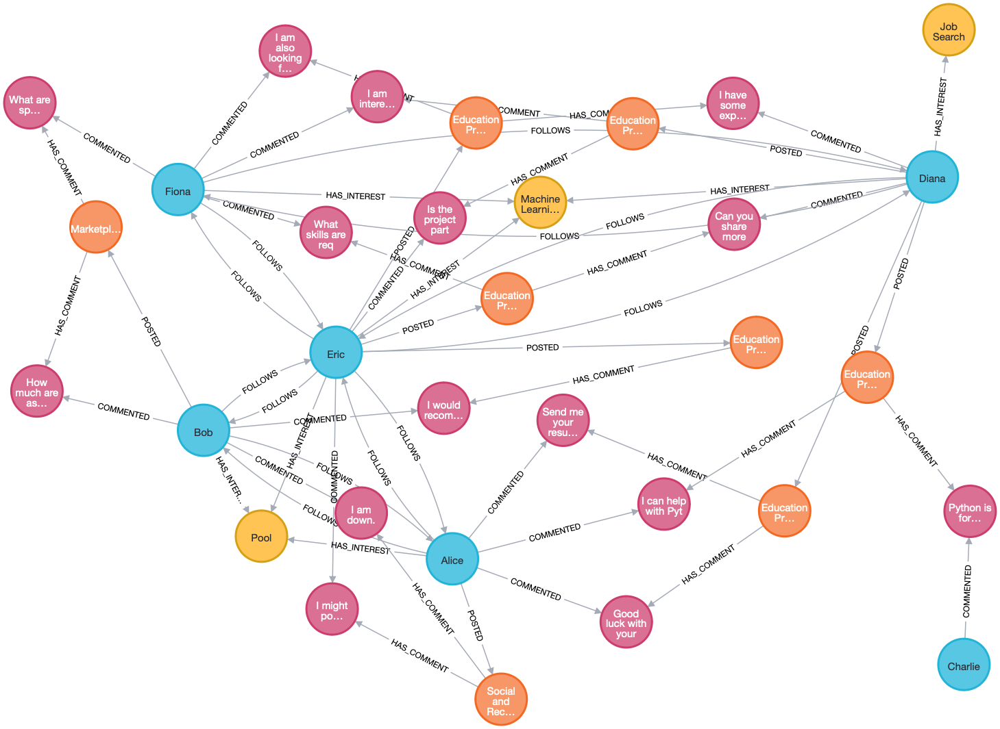
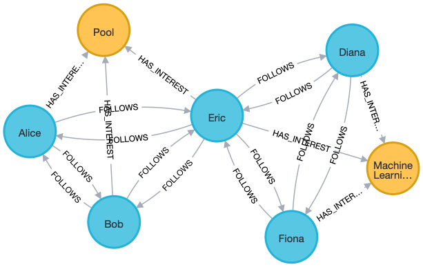

# Social Network Database in Neo4j

This project is to create a social networking platform specifically for Data Science Institute students and alumni, where members can share insights, seek advice, and remain connected based on shared interests, be they project-based, career-oriented, or hobby-related. 

## Database Design
### Nodes Definition
- User: user_id, first_name, last_name, email, phone_number, graduation_year
- Post: post_id, post_text, post_date
- Comment: comment_id, comment_text, comment_date
- Interest: interest_id, interest_name

### Relationships Definition
- (User)-[:POSTED]->(Post)
- (User)-[:COMMENTED]->(Comment)
- (User)-[:HAS_INTEREST]->(Interest)
- (Post)-[:HAS_COMMENT]->(Comment)
- (User)-[:FOLLOWS]->(User)

### Rationale
#### Nodes
- User: The user node contains information about the user, including user_id, first_name, last_name, email, phone_number, and graduation_year. The user_id is the unique identifier for each user. The first_name and last_name are the first and last name of the user. The email is the email address of the user. The phone_number is the phone number of the user. The graduation_year is the graduation year of the user. These are all the basic information of a user, which can be used to identify a user and connect with other users.
- Post: The post node contains information about the post, including post_id, post_text, and post_date. The post_id is the unique identifier for each post. The post_text is the text of the post. The post_date is the date when the post is posted.
- Comment: The comment node contains information about the comment, including comment_id, comment_text, and comment_date. The comment_id is the unique identifier for each comment. The comment_text is the text of the comment. The comment_date is the date when the comment is posted.
- Interest: The interest_id is the unique identifier for each interest. This node is used to identify potential connections between users based on shared interests.

#### Relationships
- (User)-[:POSTED]->(Post): The user posted the post.
- (User)-[:COMMENTED]->(Comment): The user commented on the comment.
- (User)-[:HAS_INTEREST]->(Interest): The user has the interest.
- (Post)-[:HAS_COMMENT]->(Comment): The post has the comment.
- (User)-[:FOLLOWS]->(User): A user follows another user. Relationship: FOLLOWS is directed, meaning that the user who follows another user is the start node and the user who is followed by another user is the end node. This relationship is like LinkedIn connections. If two users follow each other, they are considered as friends.

## Platform Benefits and Challenges
### Benefits
- The platform can help users to connect with other users based on shared interests.
- The platform can help users to exchange information and resources.

### Challenges
- If the number of users growing rapidly, the platform may not be able to handle the large amount of data.

## Visualization of the Database

## Sample Data Insertion
'''
CREATE
(alice:User {user_id: 1, first_name: 'Alice', last_name: 'Smith', email: 'a.smith@gmail.com', phone_number: '1234567890', graduation_year: 2017}),
(bob:User {user_id: 2, first_name: 'Bob', last_name: 'Johnson', email: 'b.johnson@gmail.com', phone_number: '2345678901', graduation_year: 2018}),
(charlie:User {user_id: 3, first_name: 'Charlie', last_name: 'Brown', email: 'c.brown@gmail.com', phone_number: '3456789012', graduation_year: 2019}),
(diana:User {user_id: 4, first_name: 'Diana', last_name: 'Ross', email: 'd.ross@gmail.com', phone_number: '4567890123', graduation_year: 2024}),
(eric:User {user_id: 5, first_name: 'Eric', last_name: 'Clapton', email: 'e.clapton@gmail.com', phone_number: '5678901234', graduation_year: 2024}),
(fiona:User {user_id: 6, first_name: 'Fiona', last_name: 'Apple', email: 'f.apple@gmail.com', phone_number: '6789012345', graduation_year: 2024})

CREATE
(post1:Post {post_id: 1, post_text: 'I am looking for a project partner for the Capstone project.', post_date: '2023-01-01', topic: 'Education and Professional Development'}),
(post2:Post {post_id: 2, post_text: 'Anyone wants to play pool this weekend?', post_date: '2023-01-02', topic: 'Social and Recreational Activities'}),
(post3:Post {post_id: 3, post_text: 'I am looking for a job in data science.', post_date: '2023-01-03', topic: 'Education and Professional Development'}),
(post4:Post {post_id: 4, post_text: 'Does anyone have recommendations for a good Machine Learning book?', post_date: '2023-01-04', topic: 'Education and Professional Development'}),
(post5:Post {post_id: 5, post_text: 'Looking for team members for a hackathon next month.', post_date: '2023-01-05', topic: 'Education and Professional Development'}),
(post6:Post {post_id: 6, post_text: 'Selling a barely used laptop. DM for details.', post_date: '2023-01-06', topic: 'Marketplace and Exchange'}),
(post7:Post {post_id: 7, post_text: 'Looking for a study group for the machine learning course.', post_date: '2023-01-07', topic: 'Education and Professional Development'}),
(post8:Post {post_id: 8, post_text: 'Can anyone help with Python coding? I got some bugs in my code.', post_date: '2023-01-08', topic: 'Education and Professional Development'})

CREATE
(comment1:Comment {comment_id: 1, comment_text: 'I am interested.', comment_date: '2023-01-01'}), // post_id: 1
(comment2:Comment {comment_id: 2, comment_text: 'I am down.', comment_date: '2023-01-02'}), // post_id: 2
(comment3:Comment {comment_id: 3, comment_text: 'Good luck with your job search!', comment_date: '2023-01-03'}), // post_id: 3
(comment4:Comment {comment_id: 4, comment_text: 'I would recommend "Deep Learning".', comment_date: '2023-01-04'}), // post_id: 4
(comment5:Comment {comment_id: 5, comment_text: 'What skills are required for the hackathon?', comment_date: '2023-01-05'}), // post_id: 5
(comment6:Comment {comment_id: 6, comment_text: 'What are the specs of the laptop?', comment_date: '2023-01-06'}), // post_id: 6
(comment7:Comment {comment_id: 7, comment_text: 'I am also looking for a study group!', comment_date: '2023-01-07'}), // post_id: 7
(comment8:Comment {comment_id: 8, comment_text: 'I can help with Python. What issues are you facing?', comment_date: '2023-01-08'}), // post_id: 8
(comment9:Comment {comment_id: 9, comment_text: 'Send me your resume.', comment_date: '2023-01-09'}), // post_id: 3
(comment10:Comment {comment_id: 10, comment_text: 'I might join for pool!', comment_date: '2023-01-10'}), // post_id: 2
(comment11:Comment {comment_id: 11, comment_text: 'Is the project partner position still open?', comment_date: '2023-01-11'}), // post_id: 1
(comment12:Comment {comment_id: 12, comment_text: 'Can you share more details about the hackathon?', comment_date: '2023-01-12'}), // post_id: 5
(comment13:Comment {comment_id: 13, comment_text: 'I have some experience in ML. Maybe I can join the study group.', comment_date: '2023-01-13'}), // post_id: 7
(comment14:Comment {comment_id: 14, comment_text: 'How much are you asking for the laptop?', comment_date: '2023-01-14'}), // post_id: 6
(comment15:Comment {comment_id: 15, comment_text: 'Python is my forte. Let me know if you need help.', comment_date: '2023-01-15'}), // post_id: 8

CREATE
(interest1:Interest {interest_id: 1, interest_name: 'Machine Learning'}),
(interest2:Interest {interest_id: 2, interest_name: 'Pool'}),
(interest3:Interest {interest_id: 3, interest_name: 'Job Search'})

CREATE
(diana)-[:POSTED]->(post1),
(alice)-[:POSTED]->(post2),
(diana)-[:POSTED]->(post3),
(eric)-[:POSTED]->(post4),
(eric)-[:POSTED]->(post5),
(bob)-[:POSTED]->(post6),
(eric)-[:POSTED]->(post7),
(diana)-[:POSTED]->(post8)

CREATE
(fiona)-[:COMMENTED]->(comment1),
(bob)-[:COMMENTED]->(comment2),
(alice)-[:COMMENTED]->(comment3),
(bob)-[:COMMENTED]->(comment4),
(fiona)-[:COMMENTED]->(comment5),
(fiona)-[:COMMENTED]->(comment6),
(fiona)-[:COMMENTED]->(comment7),
(alice)-[:COMMENTED]->(comment8),
(alice)-[:COMMENTED]->(comment9),
(eric)-[:COMMENTED]->(comment10),
(eric)-[:COMMENTED]->(comment11),
(diana)-[:COMMENTED]->(comment12),
(diana)-[:COMMENTED]->(comment13),
(bob)-[:COMMENTED]->(comment14),
(charlie)-[:COMMENTED]->(comment15)

CREATE
(eric)-[:HAS_INTEREST]->(interest1),
(diana)-[:HAS_INTEREST]->(interest1),
(fiona)-[:HAS_INTEREST]->(interest1),
(alice)-[:HAS_INTEREST]->(interest2),
(bob)-[:HAS_INTEREST]->(interest2),
(eric)-[:HAS_INTEREST]->(interest2),
(diana)-[:HAS_INTEREST]->(interest3)

CREATE
(eric)-[:FOLLOWS]->(diana),
(eric)-[:FOLLOWS]->(fiona),
(diana)-[:FOLLOWS]->(fiona),
(diana)-[:FOLLOWS]->(eric),
(fiona)-[:FOLLOWS]->(eric),
(fiona)-[:FOLLOWS]->(diana),
(alice)-[:FOLLOWS]->(bob),
(alice)-[:FOLLOWS]->(eric),
(bob)-[:FOLLOWS]->(alice),
(bob)-[:FOLLOWS]->(eric),
(eric)-[:FOLLOWS]->(alice),
(eric)-[:FOLLOWS]->(bob)

CREATE
(post1)-[:HAS_COMMENT]->(comment1),
(post1)-[:HAS_COMMENT]->(comment11),
(post2)-[:HAS_COMMENT]->(comment2),
(post2)-[:HAS_COMMENT]->(comment10),
(post3)-[:HAS_COMMENT]->(comment3),
(post3)-[:HAS_COMMENT]->(comment9),
(post4)-[:HAS_COMMENT]->(comment4),
(post5)-[:HAS_COMMENT]->(comment5),
(post5)-[:HAS_COMMENT]->(comment12),
(post6)-[:HAS_COMMENT]->(comment6),
(post6)-[:HAS_COMMENT]->(comment14),
(post7)-[:HAS_COMMENT]->(comment7),
(post7)-[:HAS_COMMENT]->(comment13),
(post8)-[:HAS_COMMENT]->(comment8),
(post8)-[:HAS_COMMENT]->(comment15)
'''
